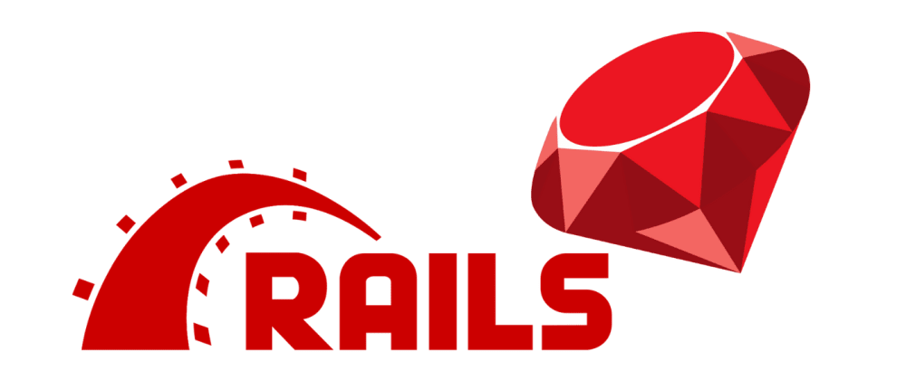

<a name="readme-top"></a>
<h1 align='center'> Cash-Buddy</h1>



# 📗 Table of Contents

- [📗 Table of Contents](#-table-of-contents)
- [ Cash Buddy ](#-cash-buddy)
  - [🛠 Built With ](#-built-with-)
    - [Tech Stack ](#tech-stack-)
    - [Key Features ](#key-features-)
    - [Screenshot](#screenshot)
  - [Loom Presentation Video](#loom-video)
  - [Live Demo](#live-demo)
  - [💻 Getting Started ](#-getting-started-)
    - [Prerequisites](#prerequisites)
    - [Setup](#setup)
    - [Install](#install)
    - [Database](#database)
    - [Deployment](#deployment)
  - [👥 Authors ](#-authors-)
  - [🔭 Future Features ](#-future-features-)
  - [🤝 Contributing ](#-contributing-)
  - [⭐️ Show your support ](#️-show-your-support-)
  - [🙏 Acknowledgments ](#-acknowledgments-)
  - [📝 License ](#-license-)

<!-- PROJECT DESCRIPTION -->

# Cash-Buddy <a name="about-project"></a>
> The Cash-Buddy project is a mobile web application that allows users to manage their budgets by keeping track of their transactions and associated categories. The app requires users to register and log in to ensure that their data is private. Users can add new transactions associated with categories and view the money spent on each category. The app has several pages, including the Splash Screen, Signup and Login Pages, Home Page (Categories Page), Transactions Page, Add a New Category Page, and Add a New Transaction Page.


## 🛠 Built With <a name="built-with">Ruby on rails and Posgresql</a>
### Tech Stack <a name="tech-stack"></a>

<details>
  <summary>Ruby On Rails</summary>
  <ul>
    <li><a href="">Postgresql</a></li>
  </ul>
</details>

<!-- Features -->

### Key Features <a name="key-features"></a>

- Users can register and log in to the app to access their private data.
- Introduce new transactions associated with a category.
- See the money spent on each category.
- Security: The app validates user input to prevent security vulnerabilities and uses Devise for authentication.

<p align="right">(<a href="#readme-top">back to top</a>)</p>


## 🚀 Screenshot <a name="screenshot"></a>

<div style="display: flex; width: auto; justify-content: center; margin: 0 auto;">
  
  <br />
  
</div>

## 💻 Loom Presentation Video <a name="loom-video"></a>

- [Loom Link](https://www.loom.com/share/)

<!-- GETTING STARTED -->

## 💻 Getting Started <a name="getting-started"></a>

To get a local copy up and running, follow these steps.

### Prerequisites

In order to run this project you need:

- Mac or PC
- Understanding OOP principles
- Have the following installed on your machine
    - [Ruby](https://www.ruby-lang.org/en/)
    - [Rails](https://rubyonrails.org/)
    - [PostgreSQL](https://www.postgresql.org/)

### Setup

Clone this repository to your desired folder:

```sh
  cd your-folder
  git clone git@github.com:Besufekad-HAZ/Budget-app.git (SSH)
```

### Install

Install this project with:

Install the required gems with:

```sh
bundle install
```

### Database

Create the databases and run migrations with:

```sh
rails db:create
rails db:migrate
```


### Deployment

To deploy the app you can use

- [Render](https://www.render.com/)
- [Heroku](https://www.heroku.com/)

<p align="right">(<a href="#readme-top">back to top</a>)</p>

<!-- AUTHORS -->

## 👥 Authors <a name="authors"></a>


## <a> 👤 Besufekad Alemu </a>

- GitHub: [@Besufekad-HAZ](https://github.com/Besufekad-HAZ)
- Twitter: [@BesufekadAlemu7](https://twitter.com/BesufekadAlemu7)
- LinkedIn: [@besura](www.linkedin.com/in/besura)

<p align="right">(<a href="#readme-top">back to top</a>)</p>

<!-- FUTURE FEATURES -->

## 🔭 Future Features <a name="future-features"></a>

- [ ] **Create API endpoints**
- [ ] **Integration with banking apps**
- [ ] **Bill reminders**

<p align="right">(<a href="#readme-top">back to top</a>)</p>

<!-- CONTRIBUTING -->

## 🤝 Contributing <a name="contributing"></a>

Contributions, issues, and feature requests are welcome!

Feel free to check the [issues page](https://github.com/Besufekad-HAZ/Budget-app/issues).

<p align="right">(<a href="#readme-top">back to top</a>)</p>

<!-- SUPPORT -->

## ⭐️ Show your support <a name="support"></a>

If you like this project, please leave a ⭐️

<p align="right">(<a href="#readme-top">back to top</a>)</p>

<!-- ACKNOWLEDGEMENTS -->

## 🙏 Acknowledgments <a name="acknowledgements"></a>

- I'd like to thank the [Microverse](https://www.microverse.org/) team for providing us with the opportunity to work on this amazing budget-app rails app.

- The design for this project was inspired by the work of [Gregoire Vella on Behance](https://www.behance.net/gregoirevella), whose [Original Design](https://www.behance.net/gallery/19759151/Snapscan-iOs-design-and-branding?tracking_source=) can be found on Behance. I would like to thank Gregoire for sharing his work under a Creative Commons license, which allowed us to use it in our project.


<p align="right">(<a href="#readme-top">back to top</a>)</p>

<!-- FAQ (optional) -->

## 📝 License <a name="license"></a>

This project is [MIT](https://github.com/Besufekad-HAZ/Budget-app/blob/dev/LICENSE) licensed.

<p align="right">(<a href="#readme-top">back to top</a>)</p>
